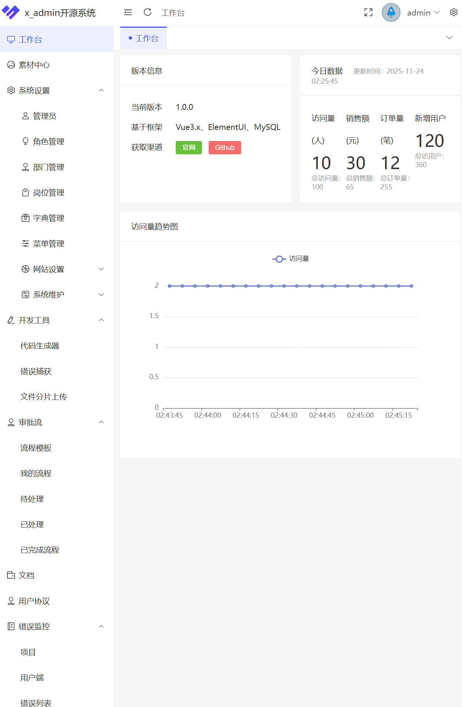
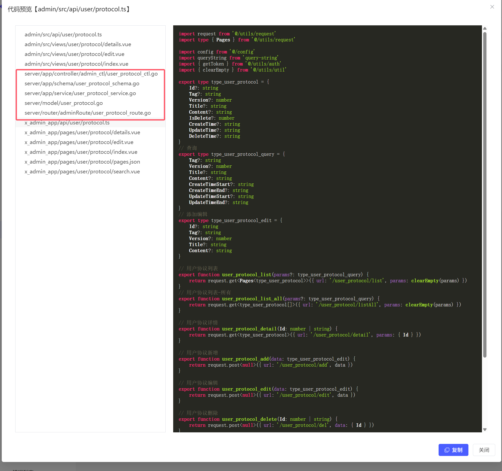
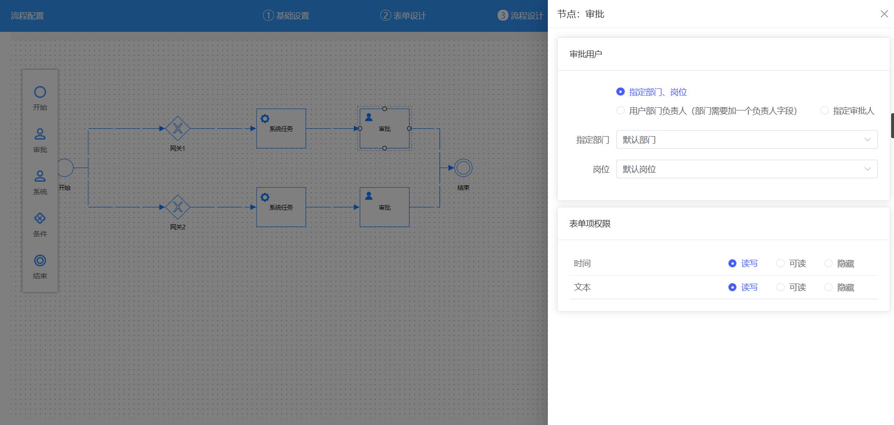
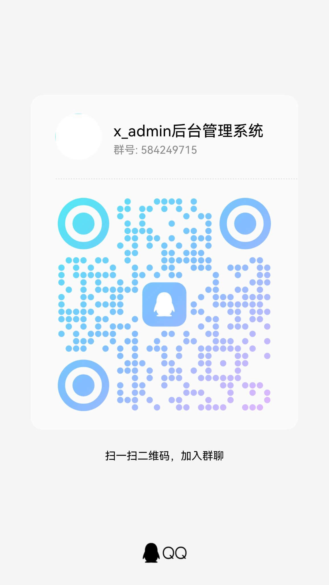

<h2 align="center">x_admin通用管理后台（GoLang、gin）(vue3、element-plus)</h2>

 
<!--  -->
 
<h6 align="center">本仓库基于：<a href="https://gitee.com/likeadmin/likeadmin_go">https://gitee.com/likeadmin/likeadmin_go</a><h6>

  

## 体验 

本仓库演示地址：http://x.adtk.cn  
账号：admin 密码：123456
    
## 文档
- 开发部署文档：https://x.adtk.cn/x_admin/
- 文档源码 : /docs

## 简介

免费开源的 x_admin 通用前后端分离管理后台系统。遵循 MIT 开源许可协议；
 

## 进一步了解
### 场景介绍

- 工作台
- 菜单权限控制
- 角色
- 管理员
- 部门管理
- 岗位管理
- 素材管理
- 网站设置
- 图库管理
- 代码生成器：一键生成前端、后端、app代码
- 审批流：基于`LogicFlow`和`FcDesigner`,整体流程待完善

 

## QQ群：<a target="_blank" href="https://qm.qq.com/cgi-bin/qm/qr?k=3owvxQhAsj6oJ6_aJKuARd-GK6dDbMdu&jump_from=webapi&authKey=c989fefqSydvK0yM5uw+y5UIPy1WfMR/OlLPnubNW9ixVp9lKsTXXth07K7zOYOH">点击链接或扫码加入</a>

 