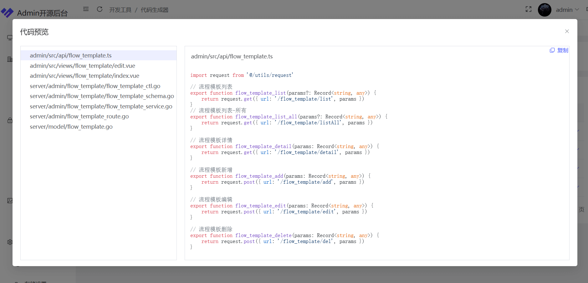

<h1 align="center">x_admin通用管理后台（GoLang）</h1>
<h4 align="center">🚀快速开发、✅后台多端自适应</h4> 

 
<!--  -->
 
<h4 align="center">本仓库基于：<a href="https://gitee.com/likeadmin/likeadmin_go">https://gitee.com/likeadmin/likeadmin_go</a><h4>

 
 
  

## 体验 

本仓库演示地址：http://x.adtk.cn  
原仓库演示地址：https://go-admin.likeadmin.cn  
账号：admin 密码：123456
    
## 开发部署文档
0. [使用](./docs/0.使用.md)
1. [打包部署](./docs/1.go-打包部署.md) 
2. [nginx配置.md](./docs/2.nginx配置.md)

## 简介

我们希望能够为开源社区做出更多的贡献，推出永久免费开源的 x_admin 通用前后端分离管理后台系统。遵循 MIT 开源许可协议，您可以免费使用，甚至允许把你基于 x_admin 开发的软件应用开源、发布、销售。
 

## 进一步了解
### 场景介绍

- 工作台
- 菜单权限控制
- 角色
- 管理员
- 部门管理
- 岗位管理
- 素材管理
- 网站设置
- 图库管理
- 代码生成器：一键生成前后端业务代码
- 审批流：基于`LogicFlow`和`VForm 3`,整体流程已实现，需要细化

 

# QQ群：<a target="_blank" href="https://qm.qq.com/cgi-bin/qm/qr?k=3owvxQhAsj6oJ6_aJKuARd-GK6dDbMdu&jump_from=webapi&authKey=c989fefqSydvK0yM5uw+y5UIPy1WfMR/OlLPnubNW9ixVp9lKsTXXth07K7zOYOH">点击链接或扫码加入（目前没人）</a>

 